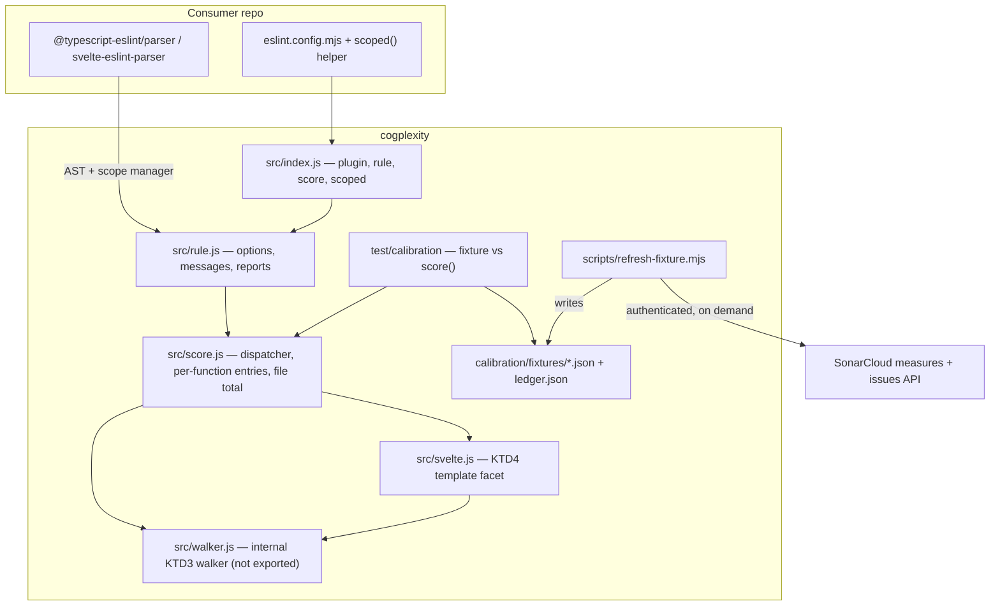
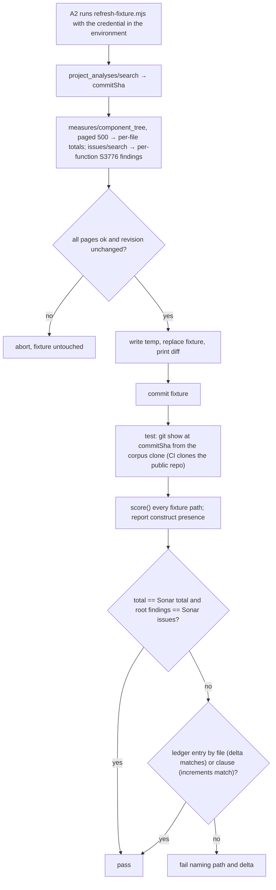

# Cognitive Complexity Rule - Plan

## Goal Capsule

- **Objective:** A coding agent working in any of the owner's TypeScript, JavaScript or Svelte repositories can run lint and receive a licence-clean, spec-traceable cognitive-complexity finding for every function or Svelte template that exceeds a threshold, with enough per-increment detail to decide what to extract.
- **Means:** An ESLint plugin, `cogplexity`, with one rule implemented from G. Ann Campbell's published Cognitive Complexity specification, plus a scoring function the rule wraps (KTD2).
- **Product authority:** `STRATEGY.md` at the repo root. The originating research (the licence findings, the measured outliers, the specification reference) is summarised in Problem Frame and Sources; this repository carries no reference to, and no dependency on, the owner's private repositories. This plan owns the package only; adoption in consumer repositories is not active scope.
- **Stop conditions:** Stop and report if the Campbell specification (v1.7) and a session-settled decision cannot both be honoured; if `svelte-eslint-parser` does not expose template blocks or script functions as walkable AST nodes; or if calibration on the reference corpus cannot reach exact match without a ledger entry whose reason is unknown.
- **Execution profile:** Five dependency-ordered units, each landable as one commit; test-first for the scoring core and the rule; smoke verification for packaging.
- **Tail ownership:** Consumer adoption and any second calibration corpus are follow-up work outside this plan.
- **Product Contract preservation:** changed: R24, R25 — the calibration corpus is now a single public reference repository and calibration also compares per-function findings (both user-directed, recorded in Key Decisions); Problem Frame, How This Work Fits Together, Success Criteria, Scope Boundaries, Dependencies and Sources were edited to remove every reference to the owner's private repositories (user-directed). All other requirements and IDs are unchanged. The five original "Deferred to Planning" questions are resolved by KTD3, KTD4, KTD5, KTD6 and KTD11; the rune question was resolved during planning; one implementation-time question remains under Outstanding Questions.

---

## Product Contract

### Summary

Build `cogplexity`: a single-rule ESLint plugin that scores cognitive complexity per Campbell's spec on TypeScript, JavaScript and Svelte, exposes the same scoring as a plain function, and proves itself with spec-conformance fixtures, a negative control, and an exact-match cross-check against SonarCloud's numbers on a public reference codebase.

### Problem Frame

Every existing cognitive-complexity implementation for the JavaScript ecosystem is unusable in an estate where coding agents read lint output on every run. The maintained one, `eslint-plugin-sonarjs` 3.x and later, ships under the SONAR Source-Available License, which forbids using outside AI to read what the program produces. The last LGPL version, 2.0.4, is end-of-life with three open advisories and no declared support for ESLint 10. The remaining options are GPL or unmaintained.

At the same time SonarCloud, the quality gate in the owner's repositories, indexes zero `.svelte` files and Sonar has stated twice that Svelte support is not planned. The Svelte components carrying the most logic have no complexity guardrail. In one of the owner's Svelte codebases, two functions measured 50 and 29 against Sonar's default threshold of 15 and nothing reported them. Another carries a live licence exposure through `eslint-plugin-sonarjs` today.

### Key Decisions

- **One rule, forever.** The package exposes cognitive complexity and nothing else; a future guardrail gets its own repository. (session-settled: user-directed — chosen over a licence-clean guardrail set with this as the first: keeping the package to one check is what prevents it becoming a second, divergent authority.) Governs R1.
- **Implemented from the specification, never forked.** No code from any version of `eslint-plugin-sonarjs` is copied. Governs R2, R19.
- **Zero runtime dependencies and no build step.** The repository is consumable as source. Governs R3, R4.
- **Independent of the owner's private repositories.** Nothing in this repository references or depends on a private repository; the calibration corpus is a public repository the package can outlive, and the harness is corpus-agnostic. (session-settled: user-directed — chosen over calibrating on the owner's private codebases: the package must remain developable and testable if those repositories disappear.) Governs R24, R27.
- **Two independent Svelte scores.** Script functions score per the spec; the template scores under a separately documented definition against its own threshold. (session-settled: user-directed — chosen over script-only and over one merged number: a spec-defined number and an invented one must not share a threshold.) Governs R8, R9, R10, R17.
- **Scoring function alongside the rule.** The package exports a plain function returning every function's score, the file total, and the per-increment breakdown; the ESLint rule is a thin wrapper over it. (session-settled: user-approved — chosen over rule-only with a threshold-0 summing trick and over a rule option emitting file totals: the harness and the agent both need structured numbers, and the check becomes testable without ESLint.) Governs R11, R12.
- **Findings carry the full per-increment breakdown by default.** An optional cap limits the list to the top N contributors. (session-settled: user-directed — chosen over score-plus-threshold only and over a fixed top-contributors summary: the agent is the primary reader and needs the whole picture; humans can cap it.) Governs R13, R14.
- **Default threshold 15, overridable.** (session-settled: user-directed — chosen over requiring an explicit threshold and over a deliberately high default: matching Sonar's default keeps the cross-check apples-to-apples.) Governs R15, R16.
- **Exact per-file match with Sonar, plus a recorded exception ledger.** (session-settled: user-approved — chosen over a numeric tolerance band and over project-total comparison: any gap is either a bug to fix or a divergence to record, and a tolerance hides both.) Governs R24, R25, R26.
- **Calibration also compares per-function findings.** Sonar's per-function S3776 issues are a second oracle beside the per-file totals. (session-settled: user-directed — chosen over per-file totals only: a file total is the same whichever function owns an increment, so totals cannot verify which functions the rule fires on.) Governs R25.
- **The specification is the authority; Sonar is a cross-check.** Divergence from Sonar is decided case by case and recorded, never chased automatically. (session-settled: user-directed — chosen over holding the spec silently and over updating the rule to match Sonar: the number must stand on its own after the initial cross-check.) Governs R26, R27.
- **Published to npm with the git URL as fallback.** (session-settled: user-directed — chosen over git-dependency only, overturning the originating report's git-only choice: reach is worth one registry credential.) Governs R5, R6.
- **Public repository.** Inferred from npm publishing. Governs R6.
- **Reuse ESLint's own mechanisms instead of gocognit's CLI conveniences.** Suppression uses `eslint-disable` comments; file scoping uses flat config; there is no CLI, no average, and no top-N listing in the package. Governs R18, R22.
- **The coding agent is the primary user.** Message shape and the scoring function serve an agent deciding what to extract; the maintainer reads what the agent surfaces. Governs R13.

<!-- ce-section: work-relationships -->
### How This Work Fits Together

This plan owns the `cogplexity` package: the rule, the scoring function, the fixtures, and the calibration harness. The breakdown below is the current understanding of the surrounding work, not a committed roadmap.

- Adoption in each of the owner's repositories — choose the file scope for that repository (Svelte only where SonarCloud already governs TypeScript; every language elsewhere), baseline existing violations, enable as `error` in the same change, and retire any `eslint-plugin-sonarjs` dependency.
  - Depends on this package reaching a tagged release.
  - Each adoption can proceed independently of the others.
  - Still to decide, per repository: scope, and whether a repository whose standing rules forbid a second local linter amends them on the strength of the calibration result.
- A second calibration corpus — another public repository with SonarCloud analysis, for independence of evidence.
  - Can proceed independently of adoption; the harness is corpus-agnostic (KTD9).
- Template-score threshold evidence — measure the template score across adopting repositories and revisit the default.
  - Depends on at least one adoption.

### Actors

- A1. **Coding agent** — runs lint on every pass inside a consumer repository, reads findings, and decides whether to extract logic into a testable seam. Primary.
- A2. **Maintainer** — reads what the agent surfaces at the commit boundary; configures thresholds and scope in the consumer's ESLint config; runs the calibration refresh.
- A3. **Calibration harness** — the package's own test that compares scoring-function output against the SonarCloud fixture.

### Requirements

**Rule and metric**

- R1. The package exposes exactly one ESLint rule, cognitive complexity, and no other lint check.
- R2. The rule implements every scoring clause of Campbell's published Cognitive Complexity specification: +1 for each break in linear flow (`if`, `else if`, `else`, ternary, `switch`, loops, `catch`, labelled `break`/`continue`, each sequence of like binary logical operators); +nesting level for each flow-breaking structure nested inside another; +1 per function in a recursion cycle; nested functions increase the nesting level; a `switch` scores once regardless of case count.
- R3. The package has zero runtime dependencies.
- R4. The package has no build step; the repository is consumable as source.
- R5. The package is published to npm and is also installable from its git URL with an exact tag.
- R6. The repository is public.
- R7. The rule runs on `.ts`, `.js`, `.svelte` and related extensions using the consumer's own parsers (`@typescript-eslint/parser`, `svelte-eslint-parser` with a nested TypeScript parser); it requires no type information.

**Svelte**

- R8. In a `.svelte` file, functions in the script block are scored exactly as in a `.ts` file.
- R9. In a `.svelte` file, the template produces one separate score from its control-flow blocks (`{#if}`, `{:else if}`, `{:else}`, `{#each}`, `{#await}` and their nesting), under a scoring definition the package documents.
- R10. The template score has its own threshold option, independent of the function threshold.

**Scoring function**

- R11. The package exports a scoring function that takes a parsed file and returns, for every function, its score and the ordered list of increments (each with location, amount, and nesting contribution), plus the file total.
- R12. The ESLint rule computes its findings through the scoring function; the two never disagree.

**Findings**

- R13. A finding names the function (or the template), its score, the threshold, and lists every increment with its location, amount, and nesting contribution.
- R14. A rule option caps the increment list to the top N contributors by amount; unset means the full list.
- R15. The function threshold defaults to 15.
- R16. The threshold is configurable per rule instance through ordinary ESLint rule options.
- R17. Findings identify which score they report, function or template, so an agent can distinguish them without parsing prose.
- R18. Per-function suppression is done with ESLint's own `eslint-disable` comments; the package defines no directive of its own.

**Licence and provenance**

- R19. The repository records that the implementation was written from the specification and not derived from any version of `eslint-plugin-sonarjs`.
- R20. The README attributes the metric and its specification to G. Ann Campbell and SonarSource.
- R21. The package is licensed MIT.

**Consumer integration**

- R22. The package exports a flat-config helper that lets a consumer scope the rule to a chosen set of file globs; it ships no preset that hardcodes which files the rule applies to.
- R23. The package declares peer support for ESLint 9 and ESLint 10.

**Calibration**

- R24. A checked-in fixture holds, for the eligible TypeScript files of a public reference repository analysed on SonarCloud — `renatomen/tasknotes-gantt` at first — SonarCloud's per-file `cognitive_complexity` values and its per-function S3776 findings (file, line, reported score), with the capture date and the analysed commit. The harness accepts any corpus with the same shape.
- R25. A test compares the scoring function's per-file totals against the fixture and passes only on exact equality, and compares every root function the rule would report at threshold 15 against the fixture's per-function findings by location and score, except for files or spec clauses listed in a checked-in exception ledger, each entry carrying a one-line reason.
- R26. The exception ledger accepts entries by file and entries by reason class (for example a spec clause Sonar does not implement), so a systematic divergence is recorded once.
- R27. A script refreshes the fixture from the SonarCloud API on demand using a credential supplied at run time; the test itself needs no network and no secret.
- R28. A negative control fixture with known complexity must produce findings at threshold 1; a run that reports zero findings on it fails.
- R29. Every scoring clause in R2, and every template construct in R9, has at least one fixture with a hand-derived expected score.

### Key Flows

- F1. Agent reads a finding
  - **Trigger:** A1 runs lint in a consumer repository; a function exceeds the threshold.
  - **Actors:** A1
  - **Steps:** The rule reports one finding at the function; the message carries score, threshold, and the increment list per R13, capped per R14 if configured; the agent picks the largest nested contribution as the extraction candidate.
  - **Outcome:** The agent extracts logic or suppresses the finding with an `eslint-disable` comment per R18.
  - **Covers:** R13, R14, R17, R18

- F2. Maintainer adopts the rule in a consumer
  - **Trigger:** A2 adds the package to a consumer's ESLint config.
  - **Actors:** A2
  - **Steps:** Install from npm or git per R5; apply the flat-config helper to the chosen globs per R22; set thresholds per R10, R15, R16.
  - **Outcome:** The rule runs on the chosen files with the chosen thresholds. Baselining existing violations is the consumer's own work.
  - **Covers:** R5, R10, R15, R16, R22

- F3. Calibration run
  - **Trigger:** The package's test suite runs, or A2 refreshes the fixture.
  - **Actors:** A2, A3
  - **Steps:** A3 scores every file named in the fixture and compares totals and over-threshold functions per R25; a mismatch not covered by the ledger per R26 fails the test; A2 either fixes the rule or adds a ledger entry with a reason; on demand A2 runs the refresh script per R27.
  - **Outcome:** Every disagreement with Sonar is either fixed or recorded.
  - **Covers:** R24, R25, R26, R27

### Acceptance Examples

- AE1. **Covers R2.** Given a function containing a `switch` with eight cases and nothing else, when scored, then the score is 1.
- AE2. **Covers R2.** Given `if (a) { for (x of xs) { if (b) {} } }`, when scored, then the increments are `if` +1, `for` +2 (incl. 1 nesting), inner `if` +3 (incl. 2 nesting), total 6.
- AE3. **Covers R2.** Given `a && b && c || d`, when scored, then the increments are one for the `&&` sequence and one for the `||`, total 2.
- AE4. **Covers R2.** Given a function that calls itself, when scored, then it receives +1 for recursion.
- AE5. **Covers R8, R9, R17.** Given a `.svelte` file whose script has one function scoring 20 and whose template nests `{#each}` inside `{#if}`, when linted at function threshold 15 and template threshold 15, then one function finding is reported for the script and no template finding is reported; the function finding identifies itself as a function score.
- AE6. **Covers R13, R14.** Given a function scoring 50 with 30 increments and no cap configured, when linted, then the finding lists all 30 increments; given the cap set to 3, then the finding lists the three largest by amount.
- AE7. **Covers R25, R26.** Given a fixture file whose Sonar total is 187 and a scoring-function total of 188 because of one recursive function, when the ledger has a reason-class entry for recursion, then the calibration test passes; when the ledger has no such entry, then it fails naming the file and the difference.
- AE8. **Covers R28.** Given the negative-control fixture, when the rule runs at threshold 1, then at least one finding is reported; when a defect makes the rule report nothing, then the test fails.
- AE9. **Covers R12.** Given any file, when the rule's findings and the scoring function's output are compared, then every reported function has the same score in both.

### Success Criteria

- Every scoring clause has a passing hand-derived fixture (R29) — the number stands on its own without Sonar.
- The calibration test passes on the reference corpus with every ledger entry carrying a reason (R25, R26).
- Runtime dependency count is zero and a dev-inclusive `npm audit` reports no advisory (R3).
- A consumer can enable the rule with a one-line config change (R22).

### Scope Boundaries

- Adopting the rule in any consumer repository, including baselining existing violations and retiring `eslint-plugin-sonarjs` there, is separate work per repository.
- No second rule of any kind, including max-params or line-count checks.
- No averages, dashboards, CLI, or per-project summary output.
- No cross-check of the template score against Sonar; Sonar has no such number.
- No type-aware analysis.
- No replacement of SonarCloud as the quality gate for TypeScript in repositories where it runs.
- No languages beyond what ESLint parses in the consumer repositories.
- No reference to, and no dependency on, the owner's private repositories anywhere in this repository.

#### Deferred to Follow-Up Work

- Cross-file recursion detection (a call graph spanning modules); v1 detects cycles within one file (KTD3).
- A second calibration corpus for independence of evidence; the harness already accepts any corpus (KTD9).
- A SonarCloud project for this repository itself; its own gate is lint, tests, audit and pack check (Verification Contract).

### Dependencies / Assumptions

- SonarCloud's API continues to expose per-file `cognitive_complexity` and S3776 issues for the reference project (`renatomen_obsidian-gantt`, the SonarCloud key of `renatomen/tasknotes-gantt`). That project is not publicly readable today, so A2 holds a SonarCloud personal access token for refreshes; the token carries the maintainer's full permissions — no read-only scope exists on the current plan — so it lives only in the shell environment or a git-ignored `.env` and is rotated after each refresh session. Making the SonarCloud project public would remove the credential entirely (Outstanding Questions).
- The template score's default threshold is 15 for symmetry with the function threshold; there is no evidence behind this value, and it should be revisited once measured on adopting repositories.
- SonarJS does not score recursion, based on community reports and the absence of recursion from its rule documentation; the first calibration run confirms or refutes this only if the corpus contains a recursion cycle (KTD9).
- Consumer parsers (`svelte-eslint-parser` 1.x, `@typescript-eslint/parser` 8.x) expose the script functions and template blocks as ordinary AST nodes the rule can walk.

### Outstanding Questions

**Deferred to Implementation**

- Whether SonarJS scores recursion, and whether it applies the JavaScript compensating usage (KTD3 row "declarative outer function"). The first calibration run answers each only when the harness's construct-presence report (KTD9) shows the corpus contains at least one instance; each answer becomes a ledger entry or nothing.
- Whether to make the reference SonarCloud project public, which would let the refresh script run with no credential (maintainer decision; KTD10 supports both).

**Resolved During Planning**

- Svelte 5 runes and `<script module>` in `svelte-eslint-parser` 1.8.0: verified by parsing a fixture. `$state`, `$derived` and `$effect` are ordinary `CallExpression` nodes; the `$effect` callback is a plain `ArrowFunctionExpression`; `<script module>` is a second `SvelteScriptElement` whose `body` holds ordinary statements; an inline handler is an `ArrowFunctionExpression` under a `SvelteMustacheTag`; `parserServices.isSvelte` and `isSvelteScript` exist. An `{:else if}` is a `SvelteIfBlock` with `elseif: true` wrapped in a `SvelteElseBlock` with `elseif: true` (KTD4 carries the wrapper row).

### Sources / Research

- `STRATEGY.md` — purpose, positioning, boundaries, metrics, tracks.
- G. Ann Campbell, *Cognitive Complexity: A new way of measuring understandability*, SonarSource white paper v1.7 (29 August 2023), https://www.sonarsource.com/docs/CognitiveComplexity.pdf — the specification. Appendix B (Specification) is the clause list KTD3 implements; Appendix C (Examples) supplies four worked examples with expected totals; Appendix A (Compensating Usages) supplies the JavaScript declarative-function exception. The PDF is copyrighted and is not vendored; U2 cites page numbers.
- `eslint-plugin-sonarjs` licence history, verified from published tarballs during the originating research: 2.0.4 (LGPL-3.0, end-of-life, three open advisories), 3.0.0 and later (SONAR Source-Available License v1.0, https://www.sonarsource.com/license/ssal/), whose non-competitive-purpose clause excludes using outside AI to interact with the program's output.
- `gocognit` (https://github.com/uudashr/gocognit) — MIT implementation of the same specification for Go; source of the per-increment diagnostic shape (`Inc`, `Nesting`, `Text`, `Pos`) adopted in R11 and R13, and of the conveniences not reproduced (R18, Scope Boundaries).
- ESLint docs: custom rules (https://eslint.org/docs/latest/extend/custom-rules), plugins (https://eslint.org/docs/latest/extend/plugins), migrate to v10 (https://eslint.org/docs/latest/use/migrate-to-10.0.0) — `context.sourceCode` only, `meta.schema` mandatory, `meta.defaultOptions` since v9.15 with primitive-replaces-object merge semantics, `RuleTester` flat-config shape.
- `svelte-eslint-parser` AST spec (https://github.com/sveltejs/svelte-eslint-parser/blob/main/docs/AST.md) — `SvelteIfBlock { elseif, children, else }`, `SvelteElseBlock { elseif, children }`, `SvelteEachBlock { children, else }`, `SvelteAwaitBlock { pending, then, catch }`, `SvelteKeyBlock`, `SvelteSnippetBlock`, `SvelteScriptElement.body: Statement[]`.
- typescript-eslint AST spec (https://typescript-eslint.io/packages/typescript-estree/ast-spec/) — TS wrapper nodes and function-node type names shared with ESTree. `@typescript-eslint/parser` 8.44.1 declares an ESLint peer range of `^8.57.0 || ^9.0.0`; `svelte-eslint-parser` 1.8.0 declares `^9.37.0`.
- SonarQube Cloud Web API (https://docs.sonarsource.com/sonarqube-cloud/appendices/web-api) — `api/measures/component_tree` parameters, `api/issues/search` for rule-filtered issues, `api/project_analyses/search` for the analysed revision, bearer-scheme authentication, page size cap 500, 429 rate limiting.
- npm trusted publishing (https://docs.npmjs.com/trusted-publishers/) — OIDC publish from GitHub Actions without a long-lived credential; requires npm 11.5.1 or later and Node 22.14 or later.
- Consumer configuration patterns observed in the owner's repositories: hand-written flat-config arrays with `svelte-eslint-parser` and a nested `@typescript-eslint/parser` for `.svelte`, the bare-number option form `["error", 15]` applied per language block, `eslint . --max-warnings 0`, `linterOptions.noInlineConfig` on selected files, `npm ci --ignore-scripts` in CI, SHA-pinned actions, and an in-memory `ESLint.lintText` mutation harness proving a lint gate fires.
- David Farley, *Modern Software Engineering* (owner's book notes) — Ch. 3 "Most metrics applied to software development are either irrelevant (velocity) or sometimes positively harmful (lines of code or test coverage)"; Ch. 6 "I don't like functions longer than about ten lines of code or with more than about four parameters, but these are only guides"; Ch. 9 "If my tests are hard to write, that tells me something important about the quality of my code"; Ch. 13 "Decoupling May Mean More Code"; Ch. 2 controlling variables in experiments. These bind the Boundaries, the no-coverage-target stance, and the test-first execution notes.
- Sonar community, "FP on javascript:S3776 Incorrect calculation of cognitive complexity" — the recursion indication behind the assumption above.

---

## Planning Contract

### Key Technical Decisions

- KTD1. **Plain ESM JavaScript with JSDoc types and hand-written `.d.ts` files; no compiler.** Consumers install with `npm ci --ignore-scripts`, so a git install cannot run a `prepare` build; the source must be the artifact. `package.json` carries no `build`, `prepare`, `prepack`, `install` or `postinstall` script. Cites R3, R4.
- KTD2. **Parser-agnostic scoring core; the rule is a thin wrapper.** The core walks ESTree/TSESTree node type strings and takes a root node, a source text, and an optional scope manager; it imports nothing from any parser. The exported `score()` is the dispatcher for both root types: an ESTree/TSESTree `Program` and a `svelte-eslint-parser` root, returning the `template` facet for the latter, so the rule and any external caller reach identical results (R12). The rule calls it with `context.sourceCode.ast` and `context.sourceCode.scopeManager`. Child traversal visits only own properties that are nodes or arrays of nodes (objects with a string `type`) and skips `parent`, `loc`, `range`, `tokens` and `comments`, because ESLint and `svelte-eslint-parser` attach a `parent` back-reference to every node while `@typescript-eslint/parser`'s `parse()` does not — a naive object walk terminates under the bare parser and loops forever under the rule. The shared subtree walker lives in an internal module, `src/walker.js`, imported by both `src/score.js` and `src/svelte.js` and excluded from the `exports` map and the public declarations; its contract is: visit a subtree at a given nesting, attributing to a given entry, with a functions-in-markup mode that raises nesting without opening entries. The result shape is public API: `{ functions: [{ name, kind, depth, parent, loc, nameLoc, score, increments }], topLevel: { kind: "topLevel", score, increments }, template?: { kind: "template", score, increments }, total }`, where each increment is `{ construct, amount, nesting, loc }` and `construct` is one of a short identifier set declared in `score.d.ts` (`if`, `elseIf`, `else`, `ternary`, `switch`, `loop`, `catch`, `logicalSequence`, `labelledJump`, `recursion`, and the KTD4 template identifiers). The same identifiers name ledger clause entries (KTD9) and message lines (KTD6). Entries carry locations, never AST nodes. `template` is present only for Svelte files and is excluded from `total`, because the two numbers never share a threshold (Product Contract decision governing R8–R10). (session-settled: user-approved — chosen over rule-only and over a rule option for file totals; per the Product Contract decision governing R11, R12. The optional scope manager and the exported dispatcher were review findings the user accepted.) Cites R11, R12.
- KTD3. **Spec clause mapping (the normative implementation of R2), from white paper v1.7 Appendix B with Appendix A's JavaScript exception.** The table below is the authority for U2; a fixture pins each row.

  | Construct | ESTree / TSESTree node | Increment | Nesting increment | Raises nesting for contents |
  |---|---|---|---|---|
  | `if` | `IfStatement` (not in `else` position) | +1 structural | yes | yes |
  | `else if` | `IfStatement` as `alternate` of an `IfStatement` | +1 hybrid | no | yes |
  | `else` | non-`if` `alternate` | +1 hybrid | no | yes |
  | ternary | `ConditionalExpression` | +1 structural | yes | yes (both branches) |
  | `switch` | `SwitchStatement` (once; cases +0) | +1 structural | yes | yes |
  | loops | `ForStatement`, `ForInStatement`, `ForOfStatement` (including `for await`), `WhileStatement`, `DoWhileStatement` | +1 structural | yes | yes |
  | `catch` | `CatchClause` (once per clause) | +1 structural | yes | yes |
  | `try`, `finally` | `TryStatement` block, `finalizer` | +0 | — | no |
  | logical sequence | a maximal run of one operator (`&&` or `\|\|`) reading the flattened operands of a logical-expression tree left to right; the run breaks when the operator changes, and a parenthesised or negated sub-expression starts its own run — so `a && b && c \|\| d` has two runs, `a \|\| b && c \|\| d` has three, and `a && !(b && c)` has two | +1 fundamental per run | no | no |
  | `??` | `LogicalExpression` with `??` | +0 (null-coalescing ignored, paper p. 6) | — | no |
  | `?.` | `ChainExpression` | +0 (unwrap and continue) | — | no |
  | labelled jump | `BreakStatement`/`ContinueStatement` with `label` | +1 fundamental | no | no |
  | recursion | each function in a same-file call cycle (direct or mutual). Callees resolve through the scope manager the caller supplies (KTD2) or, without one, through a hoisting-aware scope map the walker keeps itself, keyed by declaring scope for functions and by (class node, method name, static flag) for `this.method` calls. The increment's location is the recursive call's callee token | +1 fundamental, once per function | no | no |
  | nested function | `FunctionDeclaration`, `FunctionExpression`, `ArrowFunctionExpression`, a class method or class-field value, `StaticBlock`, inside another function | +0; increments accrue to the enclosing function (KTD7) | — | yes |
  | declarative outer function (paper Appendix A, JavaScript) | a function none of whose own top-level statements is subject to a structural increment (the paper's test: "the presence at the top level of a function … of statements subject to structural increments indicates something other than a pure declarative usage") | +0 and does not raise nesting for its nested functions, which become roots (KTD7 states where their increments go) | — | no |
  | `LabeledStatement` | the label itself | +0 | — | no |
  | early `return`, `throw`, unlabelled `break`/`continue` | — | +0 | — | no |
  | TS wrappers | `TSAsExpression`, `TSSatisfiesExpression`, `TSNonNullExpression`, `TSTypeAssertion` | +0 (transparent) | — | no |
  | TS declarations | `TSDeclareFunction`, `TSInterfaceDeclaration`, `TSTypeAliasDeclaration`, `TSAbstractMethodDefinition` | not walked | — | — |
  | `TSEnumDeclaration`, `TSModuleDeclaration` | walked for nested functions only | +0 | — | no |

  A finding fires when `score > threshold`, matching Sonar's S3776 semantics; a score equal to the threshold does not fire. Cites R2, R15.
- KTD4. **Svelte template scoring definition (the normative implementation of R9).** Nesting starts at 0 at the markup root; the template is one score.

  | Template construct | Parser node | Increment | Nesting increment | Raises nesting for children |
  |---|---|---|---|---|
  | `{#if}` | `SvelteIfBlock` with `elseif: false` | +1 structural | yes | yes |
  | `{:else if}` | `SvelteIfBlock` with `elseif: true` | +1 hybrid | no | yes |
  | wrapper of an `{:else if}` | `SvelteElseBlock` with `elseif: true` (holds exactly one `SvelteIfBlock`) | +0 (transparent) | — | no |
  | `{:else}` (of `if` or `each`) | `SvelteElseBlock` with `elseif: false` | +1 hybrid | no | yes |
  | `{#each}` | `SvelteEachBlock` | +1 structural | yes | yes |
  | `{#await}` | `SvelteAwaitBlock` | +1 structural | yes | yes (pending, then, catch) |
  | `{:then}`, `{:catch}` | `SvelteAwaitThenBlock`, `SvelteAwaitCatchBlock` | +1 hybrid each | no | yes |
  | `{#key}` | `SvelteKeyBlock` | +0 | — | no |
  | `{#snippet}` | `SvelteSnippetBlock` | +0 (method-like) | — | yes |
  | inline function in an attribute or handler | any function node inside markup | +0 (method-like) | — | yes |
  | expression logic anywhere in markup | `LogicalExpression`, `ConditionalExpression` in a mustache tag, an attribute or directive value (`class:x={a && b}`, `bind:`), an `{#each}` key expression, or a `{@render}`/`{@const}` argument | per KTD3 at the current template nesting | per KTD3 | per KTD3 |
  | `{@render}`, `{@html}`, `{@const}`, `{@debug}` tags themselves | — | +0 | — | no |

  Script functions (`<script>` and `<script module>`) are scored by the KTD3 core with nesting 0 at each root function; script statements outside any function belong to `topLevel` (KTD7). The template walker imports the shared walker from `src/walker.js` (KTD2) rather than re-implementing expression scoring. Template identifiers in `construct`: `ifBlock`, `elseIfBlock`, `elseBlock`, `eachBlock`, `awaitBlock`, `thenBlock`, `catchBlock`. Cites R8, R9, R10.
- KTD5. **Rule options: a bare number or an object.** Schema `[number | { threshold?: integer ≥ 0, templateThreshold?: integer ≥ 0 | false, topContributors?: integer ≥ 1 }]`; `meta.defaultOptions` = `[{ threshold: 15, templateThreshold: 15 }]`. A bare number sets `threshold` only; `templateThreshold` keeps its default — the rule normalises this itself, turning a numeric `context.options[0]` into `{ threshold: n, templateThreshold: 15 }` before any comparison, because ESLint's `defaultOptions` merge replaces the whole default object when the user value is a primitive. `templateThreshold: false` disables the template facet for that rule instance, so a `files`-scoped override can silence template scoring on files that forbid inline config without touching script scoring. (session-settled: user-approved — the off value was surfaced as a call-out and confirmed.) Cites R10, R14, R15, R16.
- KTD6. **Two message ids and a multi-line message.** `messageId` is `functionComplexity` or `templateComplexity`, which satisfies R17 in ESLint's JSON output and in `RuleTester` without prose parsing. Message shape: a header line `<name>: cognitive complexity <score> exceeds <threshold>` (template header names `template`), then one line per increment `+<amount> (incl. <nesting> nesting) <construct> at <line>:<column>`, ordered by amount descending then position, cut at `topContributors` when set with a final line `… <k> more`. The finding's location is the function's name (or its first token) and, for the template, the first template increment. Cites R13, R14, R17.
- KTD7. **A function's score includes everything nested inside it; the rule reports root functions; the file total sums root functions plus top-level code.** Per the paper (p. 9 and Appendix A), a nested function or lambda adds no increment of its own but raises the nesting level, and its increments accrue to the enclosing function — the paper's YUI `save` example scores 20 only because its callbacks' increments count toward `save`. Accordingly: every function entry's `score` is inclusive of its nested functions; the scoring function returns an entry for every function with `depth` and a `parent` index so an agent can still see which callback carries the weight; the rule reports only root functions (depth 0, or a function promoted to root by the Appendix A exception), since a root always scores at least as much as anything nested in it; `total` is the sum of root-function scores plus `topLevel.score`. **Promotion invariant:** when an Appendix A container promotes a nested function to a root, that function's increments leave the container's attribution and are counted exactly once, through the promoted root; the container's own score then covers only its remaining direct content. An empty function appears with score 0 and an empty increment list. Statements outside any function form the `topLevel` field (`kind: "topLevel"`), returned by the scoring function and never reported by the rule; it exists so per-file totals can match Sonar's file metric. Rejected: exclusive per-function attribution — it contradicts R2 and the Appendix C totals, and would move the measured outliers (50 and 29, captured under inclusive attribution) below the threshold. Cites R2, R11, R12.
- KTD8. **Tests run on `node:test` with ESLint's `RuleTester` bound to it; no Jest.** `RuleTester.describe`/`RuleTester.it` are assigned from `node:test`. Two rule suites exist, one per parser, because the two parsers produce different root nodes. Dev dependencies are limited to `eslint`, `@eslint/js`, `@typescript-eslint/parser`, `svelte-eslint-parser`, `svelte` and `typescript` (parser peers). (session-settled: user-approved — chosen over Jest: zero test-runner footprint and Node's built-in runner already handles script tests in the owner's repositories.) Cites R28, R29.
- KTD9. **Calibration design.** The harness is corpus-agnostic; the initial and only corpus is the public repository `renatomen/tasknotes-gantt` (SonarCloud project key `renatomen_obsidian-gantt`). One fixture file per corpus, `calibration/fixtures/<corpus>.json`: `{ projectKey, repository, commitSha, capturedAt, sonar: { sources, testInclusions, exclusions, extensions }, files: { "<repo-relative path>": <total> }, issues: [{ path, line, score }] }`, where `issues` holds SonarCloud's S3776 findings (line and the reported score parsed from the issue message). The ledger `calibration/ledger.json` is a list of `{ kind: "file" | "clause", match, reason, addedAt, expectedDelta? }` where `match` is a repo-qualified path for `file` and a `construct` identifier (KTD2) for `clause`; every `file` entry carries `expectedDelta` (Sonar total minus local total) and the test fails when the observed delta differs from it, so an excepted file cannot absorb a later regression. The test reads each fixture path with `git show <commitSha>:<path>` from the clone named by `COGPLEXITY_CORPUS`, so a dirty tree, a worktree, or a different checked-out branch does not matter; a clone that lacks the commit fails as "corpus unavailable", distinct from a mismatch; a fixture path absent at that commit fails naming the path; a file at that commit that belongs to the fixture's recorded eligible set (extension, sources, inclusions, exclusions) but is absent from the fixture also fails, naming the path, because it means the refresh dropped an eligible file; an unset variable marks the corpus skipped with a visible reason, never passed. Per-file comparison: `score().total` must equal the fixture total. Per-function comparison: every root function the rule would report at threshold 15 must have a fixture issue at its `nameLoc` line with the same score, and every fixture issue must correspond to such a root; a difference is a mismatch. A `clause` entry covers a file only when the file's delta equals the summed amount of that construct's increments in the file (so recursion `+1` cannot mask an unrelated `+1`); a `clause` entry that covers no file fails as stale; a divergence that changes nesting rather than adding an increment (the Appendix A exception) is recorded as `file` entries. The harness also reports **construct presence** — whether the corpus at the pinned commit contains at least one recursion cycle and at least one declarative outer function — and the Outstanding Questions on Sonar's behaviour may be recorded as resolved only when the relevant construct is present. CI clones the corpus (public) at `commitSha` into a temp directory and runs the harness. Corpus files are read through `execFile` with an argument array, never a shell string. (session-settled: user-directed — a single public corpus, chosen over the owner's private codebases; the per-function oracle and the expected-delta ledger were review findings the user accepted.) Cites R24, R25, R26.
- KTD10. **Refresh script.** `scripts/refresh-fixture.mjs <corpus>` reads the credential from the `SONAR_TOKEN` environment variable (or a local `.env`) and refuses to run when `.env` is tracked by git; it never prints request headers in errors or logs; when the SonarCloud project is public it runs with no credential at all. It calls `api/project_analyses/search` for the latest `main` analysis to capture `revision` as `commitSha`, pages `api/measures/component_tree` with `metricKeys=cognitive_complexity&qualifiers=FIL&strategy=leaves&ps=500` until `paging.total` is exhausted, and pages `api/issues/search` filtered to the S3776 rule keys for the project, recording each issue's path, line, and the score parsed from its message; requests use the bearer authorization scheme rather than the legacy basic-auth form. It keeps only components whose path has a parseable extension (`.ts`, `.tsx`, `.mts`, `.cts`, `.js`, `.mjs`, `.cjs`), lies under the recorded `sonar.sources`, and is neither a test inclusion nor an exclusion; it drops any component whose response carries no `cognitive_complexity` measure; and it records the applied extension list under the fixture's `sonar` block so the harness and the refresh agree on one eligible set. A 429 retries up to three times with exponential backoff. After the last page the script re-queries the latest analysis and aborts if its revision moved during paging. Any non-2xx after retries, an auth failure, a moved revision, or a partial page set aborts without touching the fixture; a successful run writes a temp file, replaces the fixture atomically, and prints added, removed and changed paths. Cites R27.
- KTD11. **Package surface and publishing.** `package.json`: `"type": "module"`, `exports` = `{ ".": { "types": "./src/index.d.ts", "default": "./src/index.js" }, "./score": { "types": "./src/score.d.ts", "default": "./src/score.js" }, "./package.json": "./package.json" }`; `.` names `plugin` (default), `rule`, `score`, `scoped`; `./score` exposes the scoring function with a `.d.ts` that references no ESLint types, so a harness or agent can import the number without ESLint installed; `src/walker.js` is not exported; `files` = `src`, `README.md`, `LICENSE`, `PROVENANCE.md`; `engines.node` = `>=20.19.0` (ESLint 10's floor); `peerDependencies.eslint` = `^9.15.0 || ^10.0.0` (`meta.defaultOptions` needs 9.15); `svelte-eslint-parser` and `@typescript-eslint/parser` as optional peers, present only to declare the tested parser ranges (npm installs neither). The pinned parsers do not yet declare ESLint 10 as a peer, so the CI leg that proves ESLint 10 installs with `--legacy-peer-deps` and proves the rule alone; it switches to the first parser releases that declare ESLint 10 once they exist. The README states what is semver-major: the rule name, option keys (KTD5), message ids and the per-increment line grammar (KTD6), the `construct` identifiers and result shape (KTD2), and `scoped()`; it also tells git-URL consumers to commit a lockfile and install with `npm ci`, since the lockfile pins the resolved commit while a tag is mutable. Publishing uses npm trusted publishing (OIDC) from a tag-triggered GitHub Actions workflow, which requires npm 11.5.1 or later and Node 22.14 or later, so the publish job upgrades npm before publishing; the name `cogplexity` is unclaimed on the registry (checked 2026-09-04); tags are bare semver (`1.0.0`); the git fallback is `github:renatomen/cogplexity#1.0.0`. Cites R4, R5, R6, R23.
- KTD12. **Repository conventions and release governance.** Conventional-commit prefixes; one behaviour per test with a name that states the claim; a pre-commit hook under `.githooks/` (enabled with `git config core.hooksPath .githooks`, no `prepare` script, no husky) running lint and tests; GitHub Actions pinned to full commit SHAs with `permissions: contents: read`; no AI co-author trailers on commits; `AGENTS.md` at the root carries these plus the one-rule and independence boundaries from `STRATEGY.md`. Release governance: a repository tag ruleset forbids creating bare-semver tags outside the release process and forbids moving or deleting them; the publish workflow is bound to a GitHub environment with a required reviewer; and the publish job runs lint, tests, the type check and the pack check before `npm publish`, since provenance attests the commit, not its test status. (session-settled: user-approved — the conventions were surfaced as a call-out and confirmed; the release governance was a review finding the user accepted.)
- KTD13. **The package lints itself with its own rule at threshold 15** alongside `@eslint/js` recommended, so the rule is exercised on real code on every commit and the package's own functions stay under the guardrail; this is also the only place the rule runs under espree, the parser plain-JavaScript consumers use. Cites R1, R7.

### High-Level Technical Design

Package components and the direction of dependency. The rule and the harness both consume the scoring core; nothing imports from a parser; the shared walker is internal.



Calibration data flow, showing where the network boundary sits and why the test needs no secret.



### Assumptions

- SonarJS applies the JavaScript compensating usage from Appendix A; if it does not, calibration surfaces it as a clause-level ledger entry once the construct-presence report shows the corpus contains the shape.
- Logical assignment operators (`&&=`, `||=`, `??=`) receive no increment; the paper predates them and does not name them. A calibration mismatch on them becomes a clause entry.
- Sonar's per-file `cognitive_complexity` includes statements outside any function; KTD7's `topLevel` field mirrors that. If the first calibration shows Sonar excludes them, the harness compares `total - topLevel.score` and the assumption is corrected in KTD7.
- Sonar's S3776 issue message carries the function's score in the form "from X to the 15 allowed", which the refresh script parses; if the wording changes, the refresh fails loudly rather than recording empty issues.

### System-Wide Impact

The package has no runtime of its own; its blast radius is the consumers' lint pipelines and the agents reading them.

- **Public API surface for semver.** The rule name `cogplexity/cognitive-complexity`, the option keys in KTD5, the two message ids in KTD6, the `score()` return shape and `construct` identifiers in KTD2, and the `scoped()` signature are the contract consumers and agents depend on. A change to any of them is a major version; the README states this.
- **Consumers that lint with `--max-warnings 0`.** `scoped()` emits `error` severity by default (U3), so no `warn` path exists to trip that flag; a consumer choosing `warn` accepts fatal warnings knowingly.
- **Consumers with files that forbid inline config (`linterOptions.noInlineConfig`).** `eslint-disable` cannot land those files green, so the template facet's off value (KTD5) and a `files`-scoped override are the only escape; the README documents that pattern.
- **Consumers whose engineering charter names a complexity ceiling of 15 as a hard stop.** Swapping the mechanism is a charter-level change there; the package keeps `error` at 15 on TS, JS and Svelte as the default so the swap is behaviour-preserving — which the per-function oracle in KTD9 is what makes checkable.
- **Consumers whose pre-commit hook lints the whole repository.** An incomplete baseline at adoption blocks every unrelated commit; the ratchet convention (fix the few current violations, then enable as `error`) governs that follow-up, not this package.
- **Engines floor.** The package requires Node `>=20.19.0` (ESLint 10's floor); a consumer declaring a lower floor sees an npm engines warning on install unless `engine-strict` is set. The README names the floor so consumers can raise theirs.

### Risks & Dependencies

| Risk | Impact | Mitigation |
|---|---|---|
| The pinned parsers exclude ESLint 10 as a peer, and no consumer runs ESLint 10 today | The ESLint 10 leg fails at install; R23 is unproven | The leg installs with `--legacy-peer-deps` and proves the rule alone (KTD11); U3 uses `context.sourceCode` only; the leg switches to ESLint-10-declaring parsers when released |
| SonarCloud API drift, undocumented rate-limit threshold, expired credential, changed issue-message wording | Refresh fails or returns partial data | KTD10: retries on 429, abort-without-write on any failure, atomic replace, loud failure on unparseable issue messages; the test never touches the network |
| Fixture and corpus source diverge | Exact match reports spurious mismatches | KTD9 pins `commitSha` and reads every fixture path at that commit with `git show`; CI clones at that commit |
| The reference corpus repository disappears or its history is rewritten | Calibration cannot run | KTD9 reports "corpus unavailable" as a distinct failure; the harness is corpus-agnostic, so a new public corpus can be captured; unit and spec tests never depend on the corpus |
| The reference corpus lacks a recursion cycle or a declarative outer function | The Sonar-behaviour questions cannot be answered by that corpus | KTD9's construct-presence report gates recording either question as resolved; a second corpus is deferred follow-up work |
| SonarJS omits a spec clause (recursion; Appendix A compensating usage; logical assignment) | Systematic mismatch on one construct | KTD9 `clause` ledger entries record the divergence once, verified against increment counts; the spec stays the authority (Product Contract decision governing R26, R27) |
| Clean-room provenance erodes as contributors join | Licence exposure the package exists to avoid | `PROVENANCE.md` and `AGENTS.md` forbid reading or copying any `eslint-plugin-sonarjs` version; review checks it |
| Git install packs the tarball, so a file missing from `files` is silently absent | Consumer install resolves but import fails | KTD11 `files` allowlist; `scripts/pack-check.mjs` asserts every `exports` target ships; a scratch git-install smoke test in U1 and U3 |
| A moved or force-pushed release tag ships different code | Consumers on the git URL without a lockfile, or a compromised account, publish silently | KTD12 tag ruleset, reviewer-gated publish environment, pre-publish gates; README lockfile guidance (KTD11) |
| npm trusted publishing needs a one-time trusted-publisher configuration and npm ≥ 11.5.1 | First publish fails until configured | U1 documents the setup and upgrades npm in the publish job; the name `cogplexity` is unclaimed on the registry as of 2026-09-04 |
| `svelte-eslint-parser` version spread across consumers (1.3 to 1.8) | AST shape differences break the template walker | U4 CI runs the Svelte suite under both versions; the rune fixture guards upgrades |
| Template default threshold of 15 has no evidence | Over- or under-reporting on Svelte markup | Recorded as an assumption; revisited after the first adoption (How This Work Fits Together) |
| A squatter claims `cogplexity` before the first publish | The README's install command resolves to someone else's package | U1 publishes the placeholder as `0.0.1` as soon as the scaffold is green |

### Sequencing

U1 → U2 → U3 → U4 → U5. U4 depends on U2 and U3. U5 depends on U1 (CI) and U2 (scoring) and can start after U2 while U3 and U4 proceed.

---

## Output Structure

```text
cogplexity/
  package.json
  package-lock.json             # committed; every CI command starts with npm ci
  LICENSE                       # MIT
  README.md                     # usage, options, attribution to Campbell/SonarSource
  PROVENANCE.md                 # written from the spec; no eslint-plugin-sonarjs code
  AGENTS.md                     # conventions (KTD12), one-rule and independence boundaries
  .npmrc                        # tag-version-prefix=""
  .githooks/pre-commit
  .github/workflows/ci.yml      # lint, type check, test matrix, audit, pack check, calibration
  .github/workflows/publish.yml # tag → gates → npm trusted publishing (reviewer-gated environment)
  eslint.config.js              # @eslint/js recommended + own rule at 15
  src/
    index.js  index.d.ts        # plugin object; named exports plugin, rule, score, scoped
    score.js  score.d.ts        # dispatcher and result shape (KTD2, KTD7)
    walker.js                   # internal KTD3 walker; not exported
    svelte.js                   # KTD4 template facet
    rule.js                     # KTD5 options, KTD6 messages
    config.js                   # scoped(globs, options) helper
  test/
    spec/clauses.test.js        # one fixture per KTD3 row
    spec/examples.test.js       # white paper Appendix C examples ported
    rule/typescript.test.js     # RuleTester under @typescript-eslint/parser
    rule/svelte.test.js         # RuleTester under svelte-eslint-parser
    rule/negative-control.test.js
    calibration/calibrate.test.js
    fixtures/                   # .ts / .svelte sources used by the suites
  calibration/
    fixtures/tasknotes-gantt.json
    ledger.json
  scripts/
    refresh-fixture.mjs
    refresh-fixture.test.js
    pack-check.mjs              # asserts tarball contents against exports
```

---

## Implementation Units

### U1. Package scaffold, conventions and CI

- **Goal:** A public, MIT, zero-dependency, no-build ESM package skeleton whose CI proves lint, type declarations, tests, audit and pack contents under ESLint 9 and 10, and whose release path is governed.
- **Requirements:** R3, R4, R5, R6, R19, R20, R21, R23; KTD1, KTD8, KTD11, KTD12, KTD13.
- **Dependencies:** none.
- **Files:** `package.json`, `package-lock.json`, `LICENSE`, `README.md`, `PROVENANCE.md`, `AGENTS.md`, `.npmrc`, `.gitignore`, `.githooks/pre-commit`, `.github/workflows/ci.yml`, `.github/workflows/publish.yml`, `eslint.config.js`, `scripts/pack-check.mjs`, `src/index.js` (placeholder exports only), `src/index.d.ts`.
- **Approach:**
  1. Write `package.json` per KTD11 with `scripts`: `test` = `node --test "test/**/*.test.js" "scripts/*.test.js"`, `lint` = `eslint .`, `audit:dev` = `npm audit --audit-level=high`, `pack:check` = `node scripts/pack-check.mjs`, `calibrate` = the U5 test file only. No `prepare`. Generate and commit `package-lock.json` in the same change, since every CI command starts with `npm ci`. `.gitignore` excludes `.env` and `.env.*` from the first commit (KTD10 accepts a local `.env`, and R6 makes the repository public).
  2. Write `scripts/pack-check.mjs`: run `npm pack --dry-run --json`, verify every resolved `exports` target is in the tarball, fail on any file under `test/` or `calibration/`, exit non-zero on mismatch.
  3. Write `PROVENANCE.md` stating the implementation source (white paper v1.7), the date, and that no `eslint-plugin-sonarjs` code of any version was read or copied; link it from the README's attribution section (R19, R20).
  4. Write `AGENTS.md` with the KTD12 conventions, the KTD13 self-lint, and the `STRATEGY.md` boundaries verbatim, including that nothing in this repository may reference or depend on the owner's private repositories.
  5. CI (`ci.yml`): `npm ci --ignore-scripts`; jobs for lint, test on a matrix of `eslint: [9, 10]` and `svelte-eslint-parser: [1.3, 1.8]` where the non-default legs run `npm i --no-save --ignore-scripts <pkg>@<exact version>` after `npm ci` (exact versions, never ranges, and no lifecycle scripts, so a hijacked matrix package cannot run code with the job token), and where the ESLint 10 leg adds `--legacy-peer-deps` because the pinned parsers exclude ESLint 10 (KTD11); a type-check step compiling a consumer-style import of `.` and `./score` with `tsc --noEmit` so the hand-written `.d.ts` files are exercised; `npm audit --omit=dev --audit-level=high` and `npm run audit:dev`; `npm run pack:check`. Actions pinned to SHAs, `permissions: contents: read`, Node 22.
  6. `publish.yml`: on a bare-semver tag, in a GitHub environment with a required reviewer, run lint, the type check, tests and the pack check, grant the job the OIDC identity permission, upgrade npm to 11.5.1 or later (Node 22 bundles 10.9, which cannot use trusted publishing), and run `npm publish --provenance` through trusted publishing. Document the one-time trusted-publisher configuration and the tag ruleset (KTD12) in the README's maintainer section.
  7. Publish the placeholder as `0.0.1` once CI is green, so the name is held.
- **Execution note:** Packaging and config; prefer smoke verification (`npm pack --dry-run`, a scratch `npm install github:…` in a temp dir) over unit coverage.
- **Patterns to follow:** the consumer CI shape observed in the owner's repositories (SHA-pinned actions, `--ignore-scripts`, an audit step); the `exports` shape of a typed ESM package with `src/` in place of `dist/`.
- **Test scenarios:**
  - `Test expectation: none -- scaffold and configuration`; verified by the smoke checks below.
- **Verification:** `npm ci --ignore-scripts && npm run lint && npm test && npm run pack:check` passes on a clean clone; `npm pack --dry-run` lists `src/index.js`, `src/index.d.ts`, `README.md`, `LICENSE`, `PROVENANCE.md` and nothing under `test/` or `calibration/`; `npm ls --omit=dev` shows no dependencies; the type-check step passes; CI green on every matrix leg; the tag ruleset and publish environment exist on the repository.

### U2. Scoring core from the specification

- **Goal:** `score(ast, sourceText, scopeManager?)` returns, for every function and the `topLevel` entry, the score and ordered increments per KTD3, plus the file total, with every clause pinned by a hand-derived fixture.
- **Requirements:** R2, R11; AE1, AE2, AE3, AE4; KTD2, KTD3, KTD7.
- **Dependencies:** U1.
- **Files:** `src/score.js`, `src/score.d.ts`, `src/walker.js`, `test/spec/clauses.test.js`, `test/spec/examples.test.js`, `test/fixtures/spec/*.ts`.
- **Approach:**
  1. Parse fixtures in tests with `@typescript-eslint/parser` (`parse()` from the package; no ESLint) so the core is tested without a rule; run the recursion fixtures both with and without a scope manager (from `parseForESLint`) so both resolution paths are covered.
  2. Implement the walker in `src/walker.js` over generic visitor keys (an own minimal key table for ESTree/TSESTree node types the walker cares about, plus a generic child fallback that visits only node-shaped own properties and skips `parent`, `loc`, `range`, `tokens`, `comments` per KTD2) that tracks the current function, the nesting level, and emits increments per the KTD3 table; expose the internal contract (start nesting, attribution target, functions-in-markup mode) for `src/svelte.js`.
  3. Logical sequences: flatten each logical-expression tree into its operand run reading left to right, treating a parenthesised or negated sub-expression as a new run; emit +1 each time the operator changes along the run and once for the first operator; treat `??` as transparent.
  4. Recursion: after the walk, build a same-file graph from call expressions whose callee resolves — through the supplied scope manager when present, otherwise through the walker's own hoisting-aware scope map — to a function declaration, a variable initialised with a function, or `this.<name>` keyed by class node, name and static flag (KTD3); mark every function in a cycle once, locating the increment at the recursive call's callee token. Aliasing (`const g = f; g()`), `.call`/`.bind`, and passing a function as a callback are not calls.
  5. Declarative outer function (Appendix A): a function none of whose own top-level statements is subject to a structural increment does not raise nesting for its nested functions, and those become root functions whose increments leave the container's attribution and are counted once (KTD7).
  6. Attribution and shape per KTD2 and KTD7: an entry per function with `depth` and `parent`, inclusive scores, `topLevel`, `total` over roots; the increments list is in source order; `name` is the declared name, the assigned identifier, or `<anonymous>`; `construct` values come from the identifier set declared in `score.d.ts`.
  7. `score()` in `src/score.js` dispatches on the root: an ESTree/TSESTree `Program` goes through the walker directly; a `svelte-eslint-parser` root is handed to `src/svelte.js` (U4), which returns the function entries and the `template` facet.
- **Execution note:** Test-first; write each clause fixture with its expected score derived by hand from the paper before implementing the clause. Port the four Appendix C examples (expected totals 19, 35, 20 and 20) as TypeScript and treat their totals as the acceptance bar for the core.
- **Technical design:** Directional sketch of the walker state: `enterFunction(node)` pushes `{ node, score: 0, increments: [] }`; `visit(node, nesting)` decides per KTD3 row whether to emit `{ amount: 1 + (nestingIncrement ? nesting : 0) }` and with which `nesting` to visit children; `else if` visits its `if` without the nesting increment but with `nesting + 1` for the consequent.
- **Patterns to follow:** gocognit's diagnostic shape (`Inc`, `Nesting`, `Text`, `Pos`) for the increment record; `node:test` + `node:assert/strict` style.
- **Test scenarios:**
  - Covers AE1. A `switch` with eight cases scores 1; increments list holds one `switch` entry.
  - Covers AE2. `if` containing `for` containing `if` scores 6 with increments 1, 2, 3 and nesting 0, 1, 2.
  - Covers AE3. `a && b && c || d` scores 2; `a || b && c || d` scores 3 (three operator runs); `a && !(b && c)` scores 2 (paper p. 8); `a && b || c && d` scores 3.
  - Covers AE4. A function calling itself scores +1 with the increment located at the callee token of the recursive call; a pair `f` → `g` → `f` gives each +1; a call to a same-named function in another scope does not; a shadowing local (`function f() { const f = x; f(); }`) and a shadowing parameter (`function f(f) { f(); }`) do not; two classes with a same-named method calling `this.m()` do not cross; `this.m()` inside a non-arrow function expression within a method does not; `const g = f; g()` and `f.call(this)` do not count as calls. Each of these passes identically with and without a scope manager supplied.
  - `if / else if / else`: `if` +1, `else if` +1 with no nesting increment, `else` +1; a nested `if` inside the `else` branch gets +2.
  - Nested ternary: outer +1, inner +2.
  - `catch` with a nested `if` scores +1 and +2; `try` and `finally` add nothing.
  - Labelled `continue OUT` inside two loops: paper's `sumOfPrimes` scores 7; the `LabeledStatement` itself adds nothing.
  - Arrow callback inside a function: an `if` inside the callback adds +2 (nesting 1) to the enclosing function's score; the callback also appears as an entry with `depth` 1, `parent` pointing at the enclosing function, and score 2; `total` counts it once.
  - Declarative outer function per Appendix A: totals 1 and 3 for the paper's two examples; the inner function of the declarative case is a root entry with `depth` 0; a declarative container holding a nested function with 4 points reports the container at 0 and the promoted root at 4, and `total` is 4; a function whose only statement is `return xs.map(x => x ? a : b)` is not declarative and scores 2 (ternary +2 at nesting 1).
  - A class field arrow value and a `static {}` block raise nesting for their contents and add nothing themselves.
  - `a ?? b` scores 0; `a?.b?.c` scores 0; `x as T`, `x!`, `x satisfies T` wrapping a scored expression change nothing.
  - Empty function returns score 0 with an empty increments list; a file with only a top-level `if` returns `topLevel` with score 1, no function entries, and total 1.
  - Every `construct` value in every increment is a member of the declared identifier set; no other strings appear.
  - Appendix C: `overriddenSymbolFrom` 19, `addVersion` 35, `toRegexp` 20, YUI `save` 20.
  - Increment order is source order; `loc` line and column match the construct's keyword or operator token.
- **Verification:** `npm test` passes; every KTD3 row has a named test; the four Appendix C totals match; `score()` is importable with no ESLint in scope; `src/walker.js` is absent from `exports` and from `src/index.d.ts`.

### U3. ESLint rule, plugin object and scoping helper

- **Goal:** The `cogplexity/cognitive-complexity` rule reports over-threshold root functions through the core with KTD5 options and KTD6 messages, and the package exposes the plugin object and the `scoped()` helper.
- **Requirements:** R1, R7, R12, R13, R14, R15, R16, R17, R18, R22, R28; AE6, AE8, AE9; KTD5, KTD6, KTD7, KTD13.
- **Dependencies:** U1, U2.
- **Files:** `src/rule.js`, `src/index.js`, `src/index.d.ts`, `src/config.js`, `test/rule/typescript.test.js`, `test/rule/negative-control.test.js`, `test/fixtures/rule/*.ts`, `eslint.config.js` (enable self-lint per KTD13).
- **Approach:**
  1. Rule `meta`: `type: "suggestion"`, `docs.url` to the README, `schema` per KTD5, `defaultOptions`, `messages` with the two ids from KTD6. Use `context.sourceCode` only; no removed accessors. Normalise `context.options[0]` per KTD5 before reading any threshold, since a bare number replaces the default object rather than merging into it.
  2. `create()` runs `score(context.sourceCode.ast, text, context.sourceCode.scopeManager)` on `Program:exit`, then reports each root function (KTD7) whose score exceeds `threshold` at its `nameLoc` (or first token), building the message per KTD6 and applying `topContributors`; nested entries are never reported separately, their increments appear in the root's breakdown.
  3. Plugin object: `meta.name`/`meta.version` from `package.json`, `rules: { "cognitive-complexity": rule }`. `scoped(files, options)` returns one flat-config entry `{ files, plugins: { cogplexity }, rules: { "cogplexity/cognitive-complexity": ["error", options ?? 15] } }`; no parser settings, no preset globs (R22).
  4. Bind `RuleTester` to `node:test` and run under `@typescript-eslint/parser` with `languageOptions.parser`.
  5. Negative control: a `RuleTester` case at `{ threshold: 1 }` on a one-`if` function, plus an `ESLint.lintText` check against the real `eslint.config.js` proving the self-lint is wired.
- **Execution note:** Test-first for messages and option handling; the `RuleTester` `errors` assert `messageId` and `data`, not raw message text, except one test that pins the exact multi-line shape.
- **Patterns to follow:** plain `.mjs` with JSDoc and a direct-run guard for `config.js`; an in-memory `ESLint.lintText` mutation harness for the negative control.
- **Test scenarios:**
  - Covers AE9. For each spec fixture, the rule at threshold 0 reports every root function with the same score `score()` returns.
  - Termination under ESLint: the rule runs the core on `context.sourceCode.ast`, whose nodes carry `parent` back-references, and completes on every spec fixture; a walker that follows `parent` would hang here and nowhere in U2.
  - Scope manager pass-through: the recursion fixtures produce the same increments under the rule (scope manager supplied) as under the bare parser (walker's own map).
  - Covers AE6. A function scoring 50 with 30 increments reports all 30 lines; with `topContributors: 3` it reports the three largest by amount and a `… 27 more` line.
  - Covers AE8. At `threshold: 1` the negative-control fixture yields one `functionComplexity` finding; a stub rule that reports nothing makes the same test fail.
  - Bare number: `["error", 20]` sets `threshold` 20; a function scoring 20 is not reported, 21 is.
  - Boundary: with the default options a function scoring exactly 15 is not reported; 16 is.
  - Nested callback carrying the weight: an outer function with 3 points of its own and a callback contributing 16 more produces one finding at the outer function scoring 19, whose breakdown lists the callback's increments with their nesting; no finding at the callback.
  - Declarative outer function: the same shape inside an Appendix A container produces one finding at the inner function, none at the container.
  - Top-level code scoring 20 is never reported by the rule.
  - `eslint-disable-next-line cogplexity/cognitive-complexity` suppresses a finding; `reportUnusedDisableDirectives` flags it when the function is under threshold.
  - Invalid options (`threshold: -1`, `topContributors: 0`, unknown key) are rejected by schema validation.
  - `scoped(["**/*.svelte"])` returns an entry whose `files` is exactly that list and whose rule severity is `error` at 15.
  - Under ESLint 10 (CI leg) every test above passes unchanged.
- **Verification:** `npm test` passes on both ESLint legs; `npm run lint` runs the package's own rule on `src/` with zero findings; `import { plugin, rule, score, scoped } from "cogplexity"` and `import { score } from "cogplexity/score"` resolve in a scratch project installed from the git URL, and the `./score` import type-checks with no `eslint` package installed.

### U4. Svelte facets

- **Goal:** On `.svelte` files `score()` and the rule report script functions per KTD3 and the template per KTD4 as two independent scores with independent thresholds, through one dispatcher.
- **Requirements:** R7, R8, R9, R10, R12, R17; AE5; KTD2, KTD4, KTD5.
- **Dependencies:** U2, U3.
- **Files:** `src/svelte.js`, `src/score.js` (Svelte root dispatch), `src/score.d.ts` (template result type), `test/rule/svelte.test.js`, `test/rule/negative-control.test.js` (template control), `test/fixtures/rule/*.svelte`, `README.md` (template scoring section).
- **Approach:**
  1. `score()` detects a `svelte-eslint-parser` root (`Program` whose body holds `SvelteScriptElement` / `SvelteElement` nodes, or `parserServices.isSvelte`) and routes: each `SvelteScriptElement.body` through the KTD3 walker; the markup through the KTD4 walker in `src/svelte.js`, which imports the shared walker from `src/walker.js` for mustache logic and inline functions. The rule never dispatches itself; it consumes the result.
  2. Template score is one entry `{ name: "template", score, increments }` reported with `templateComplexity` when `score > templateThreshold` and `templateThreshold !== false`.
  3. Document the KTD4 table in the README as the package's own definition, stating it is not part of Campbell's spec and is never cross-checked against Sonar.
  4. Keep a rune and `<script module>` fixture in the suite; the parser shape is already verified (Outstanding Questions, Resolved During Planning), so the fixture guards against parser upgrades rather than answering a question.
- **Execution note:** Test-first with hand-derived template scores.
- **Patterns to follow:** the consumer Svelte block shape for the `RuleTester` `languageOptions` (`parser: svelteParser`, `parserOptions.parser: tsParser`).
- **Test scenarios:**
  - Covers AE5. Script function scoring 20 plus a template with `{#each}` inside `{#if}` yields one `functionComplexity` finding and no `templateComplexity` finding at defaults.
  - Parity: for every Svelte fixture, the rule's findings equal what `score()` returns for the same parsed root, function entries and template facet alike.
  - Template `{#if}` → `{:else if}` → `{:else}` with a nested `{#each}` in the else: increments 1, 1, 1, 2; total 5.
  - `{#await}` with `{:then}` and `{:catch}` scores 3; a `{#if}` inside `{:then}` scores +2.
  - `{#key}` adds nothing and does not raise nesting; `{#snippet}` adds nothing and raises nesting for a `{#if}` inside it (+2).
  - Mustache `{a && b ? x : y}` at template root scores 2 (run +1, ternary +1); the same expression in `class:active={…}`, in an `{#each}` key, and as a `{@render row(a ? b : c)}` argument scores the same; inside an `{#if}` it scores 3 (ternary +2 at nesting 1, run +1).
  - Inline handler `onclick={() => { if (x) {} }}` contributes +2 to the template score (nesting raised by the function) and nothing to any script function.
  - `templateThreshold: 3` on a template scoring 4 reports; `templateThreshold: false` reports nothing for the template while the script finding still fires.
  - Bare number `["error", 10]` leaves `templateThreshold` at 15.
  - Both facets over threshold in one file produce two findings with distinct `messageId`s and distinct locations.
  - Template negative control: a template with one `{#if}` at `templateThreshold: 1` yields one `templateComplexity` finding.
  - `<script module>` functions and a `$effect(() => { if (x) {} })` callback are scored as functions with the expected increments.
- **Verification:** `npm test` passes; the README documents every KTD4 row; the rune fixture parses and scores under `svelte-eslint-parser` 1.3 and 1.8 in CI; `import { score } from "cogplexity/score"` on a parsed `.svelte` root returns a `template` facet.

### U5. Calibration harness and fixture refresh

- **Goal:** A checked-in SonarCloud fixture for the reference corpus, an exception ledger, a test that fails on any unexplained per-file or per-function difference, and a script that refreshes fixtures safely.
- **Requirements:** R24, R25, R26, R27; AE7; KTD9, KTD10.
- **Dependencies:** U1, U2.
- **Files:** `calibration/fixtures/tasknotes-gantt.json`, `calibration/ledger.json`, `test/calibration/calibrate.test.js`, `scripts/refresh-fixture.mjs`, `scripts/refresh-fixture.test.js`, `.github/workflows/ci.yml` (calibration job), `README.md` (calibration section).
- **Approach:**
  1. Implement the refresh script per KTD10 with the HTTP layer behind a small injectable `fetch` so the test can replay recorded responses; capture the first fixture for the reference corpus from a maintainer machine and commit it.
  2. Implement the test per KTD9: load fixture and ledger; resolve the clone from `COGPLEXITY_CORPUS`; read each fixture path with `git show <commitSha>:<path>` via `execFile` with an argument array; parse with `@typescript-eslint/parser` and compare `score().total`; compare root functions over threshold 15 against the fixture's `issues` by line and score; apply ledger entries; report every mismatch with path, Sonar total, local total and delta, and every per-function mismatch with path, line, Sonar score and local score; report construct presence; report a clone lacking the commit as "corpus unavailable".
  3. Ledger reason classes are `construct` identifiers; a `clause` entry covers a file only when the file's delta equals the summed amount of that construct's increments there; a `file` entry covers a file only when the observed delta equals its `expectedDelta`; the test asserts each `clause` entry covered at least one file.
  4. CI calibration job: clone `renatomen/tasknotes-gantt` at the fixture's `commitSha` (shallow fetch of that commit, `persist-credentials: false` if `actions/checkout` is used) into a temp directory, export `COGPLEXITY_CORPUS`, run the test.
  5. Record the first run's outcome: fix rule defects it exposes in U2, and add ledger entries only for divergences with a reason (recursion and the compensating usage are the expected candidates, and only if the presence report shows the constructs exist).
- **Execution note:** Treat the first calibration as the experiment it is: run it, expect the Appendix C fixtures to already pass, and classify every mismatch before touching the ledger.
- **Patterns to follow:** a Node script test wired into CI with a glob, never a bare directory; credential discovery from the environment with a documented exit-code convention (0 ok, 1 mismatch, 2 configuration or API error).
- **Test scenarios:**
  - Covers AE7. A fixture file at 187 and a local total of 188 with one recursive function passes with a `clause: recursion` ledger entry and fails without it, naming the file and `+1`.
  - Exact match on every fixture path and every fixture issue passes with an empty ledger.
  - Per-function: a root function the rule reports at 16 with no fixture issue at its line fails naming the function; a fixture issue at a line where the rule reports nothing fails naming the line; matching line and score passes.
  - A `file` ledger entry with `expectedDelta: -1` allows that path's mismatch of exactly `-1` and no other; a later delta of `-2` on the same path fails naming the path and both deltas.
  - A `clause: recursion` entry does not cover a file whose delta is `+1` but which contains two recursion increments, nor one whose delta is `+1` with zero recursion increments; the run fails naming the file.
  - A `clause` entry that covers zero files fails the run as stale.
  - Construct presence: the report names whether the corpus contains a recursion cycle and a declarative outer function; a corpus without either records both as "not exercised".
  - A fixture path absent at `commitSha` fails naming the path; an eligible `.ts` file at the commit that is absent from the fixture fails naming the path; a `.css` or test file absent from the fixture is ignored.
  - A clone that does not contain `commitSha` fails as "corpus unavailable" before scoring; a dirty working tree or a different checked-out branch does not affect the result; an unset `COGPLEXITY_CORPUS` marks the corpus skipped with the reason in the output, and `node --test` reports it under `skipped`.
  - Refresh: two pages of 500 and a third of 12 produce 1012 entries; a 429 on page two retries and succeeds; a 401 aborts and the existing fixture is byte-identical afterwards; a page fetch that returns fewer than `paging.total` entries after retries aborts; an analysis revision that changes between the first and last page aborts; an issue whose message does not match the expected score pattern aborts.
  - Refresh: a `.vue` component and a component with an empty `measures` array are both excluded from the fixture; the fixture's `sonar.extensions` lists exactly the applied extensions; S3776 issues are recorded with path, line and parsed score.
  - Refresh: `commitSha` comes from the latest `main` analysis and `capturedAt` is an ISO timestamp; the diff output lists added, removed and changed paths and issues.
  - Integration: the CI job on the reference corpus at the fixture commit passes with the committed ledger.
- **Verification:** `npm test` passes locally with `COGPLEXITY_CORPUS` set to a clone containing the fixture commit; CI calibration job green; `npm run calibrate` with the variable unset prints a skipped corpus, not a pass.

---

## Verification Contract

| Check | Command | Proves | Applies to |
|---|---|---|---|
| Unit and rule tests | `npm test` | KTD3 clauses, Appendix C totals, options, messages, both facets, negative controls, refresh-script behaviour | U2, U3, U4, U5 |
| ESLint 10 leg | `npm i --no-save --ignore-scripts --legacy-peer-deps eslint@<exact 10.x> && npm test` (CI matrix) | R23 holds for the rule against the pinned parsers | U3, U4 |
| Parser range leg | `npm i --no-save --ignore-scripts svelte-eslint-parser@<exact 1.3.x> && npm test` (CI matrix) | both consumer parser versions walk the same | U4 |
| Type declarations | `tsc --noEmit` over a consumer-style import of `.` and `./score` | hand-written `.d.ts` files resolve; `./score` needs no ESLint types | U1, U3 |
| Self-lint | `npm run lint` | R1 rule runs on the package at 15 with zero findings under espree; `@eslint/js` recommended | U1, U3 |
| Dependencies and advisories | `npm ls --omit=dev` shows none; `npm audit --omit=dev --audit-level=high`; `npm run audit:dev` | R3; a dev-inclusive audit stays clean | U1 |
| Pack contents | `npm run pack:check` (`scripts/pack-check.mjs` over `npm pack --dry-run --json`) | every `exports` target is in the tarball; nothing under `test/` or `calibration/` ships; `src/walker.js` ships but is not exported; exits non-zero on mismatch | U1 |
| Git install | `npm install github:renatomen/cogplexity#<tag>` in a scratch project, then import | R4, R5 with `--ignore-scripts` | U1, U3 |
| Calibration | `COGPLEXITY_CORPUS=<path> npm run calibrate` (CI: cloned at `commitSha`) | R25, R26 on the reference corpus, per file and per function; construct presence reported | U5 |
| Refresh script | `node scripts/refresh-fixture.mjs tasknotes-gantt` with the `SONAR_TOKEN` variable present | R27; abort-on-failure behaviour | U5 |
| Release gates | `publish.yml` runs lint, type check, tests and pack check before `npm publish`, inside the reviewer-gated environment | KTD12 governance; a tag alone does not publish | U1 |

Quality gates for this repository are the rows above; there is no SonarCloud project for `cogplexity` (Scope Boundaries). No coverage target is set; every KTD3 and KTD4 row has a named test instead.

---

## Definition of Done

**Global**

- All Verification Contract rows pass on a clean clone with `npm ci --ignore-scripts`, on Node 22, under ESLint 9 and 10.
- `calibration/fixtures/tasknotes-gantt.json` is committed with `commitSha`, `capturedAt` and `issues`; the CI calibration job is green; the construct-presence report has been read and the Sonar-behaviour questions recorded as resolved or as not exercised.
- Every ledger entry carries a reason; every `file` entry carries `expectedDelta`; no `clause` entry is stale.
- `README.md` documents installation (npm and git, with lockfile guidance), options (KTD5), the message shape (KTD6), the template scoring table (KTD4), calibration, the semver contract, the maintainer release process (KTD12), and the attribution (R20); `PROVENANCE.md` exists (R19).
- A bare-semver tag exists, the tag ruleset and publish environment are in place, and `npm publish` via trusted publishing succeeded; `npm view cogplexity` shows zero `dependencies`.
- Nothing in the repository references or depends on the owner's private repositories; a search for their names returns nothing.
- No abandoned or experimental code remains; every file in `src/` is either reachable from `exports` or is `src/walker.js`, and every test file runs in CI.

**Per unit**

- U1: scaffold verification checks pass; CI green on every leg with the placeholder export; `0.0.1` published.
- U2: every KTD3 row and all four Appendix C examples have passing tests, with recursion fixtures passing both with and without a scope manager; `score()` needs no ESLint.
- U3: all rule scenarios pass under `@typescript-eslint/parser` on ESLint 9 and 10; self-lint clean; negative control fails when the rule is stubbed.
- U4: all Svelte scenarios pass under `svelte-eslint-parser` 1.3 and 1.8, including rule-versus-score parity; README template table present.
- U5: calibration scenarios pass; first reference-corpus run classified; refresh script aborts cleanly on failure without touching fixtures.
